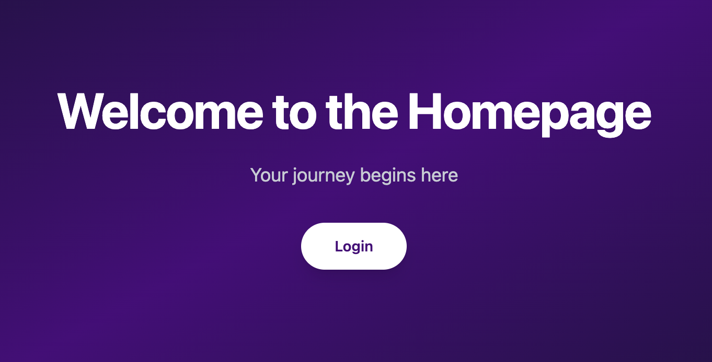
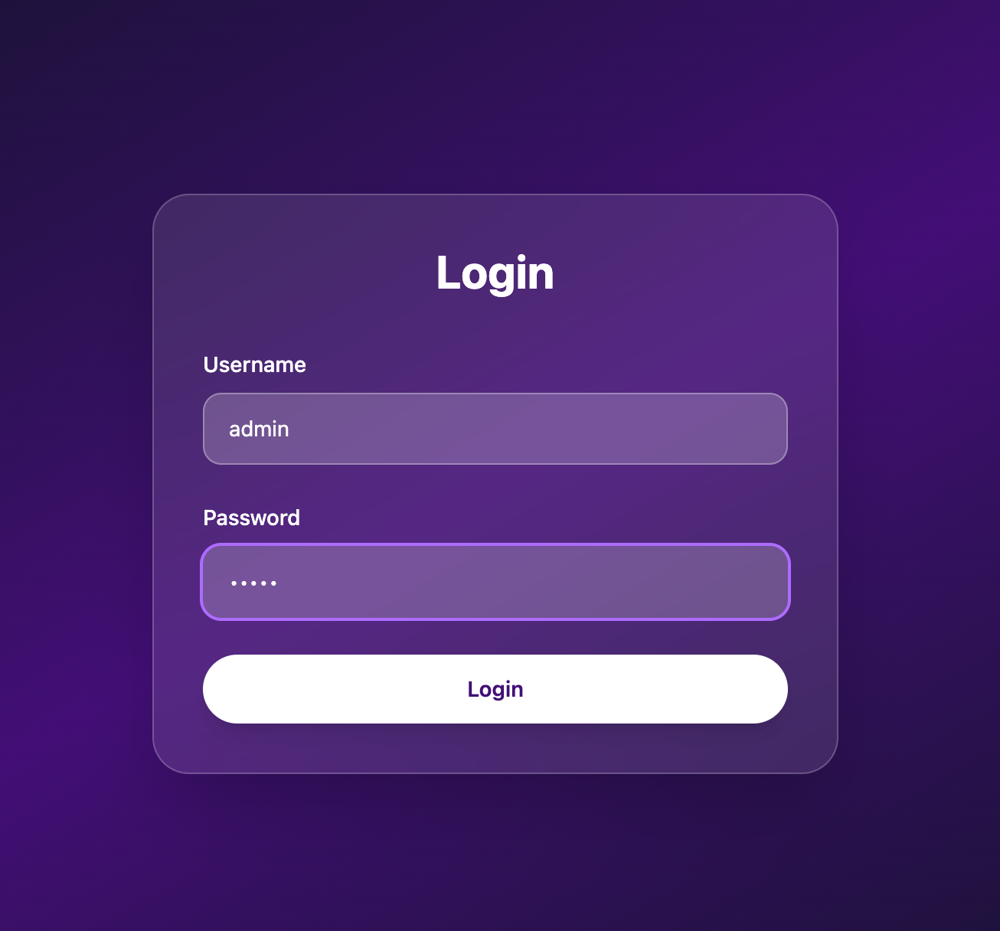
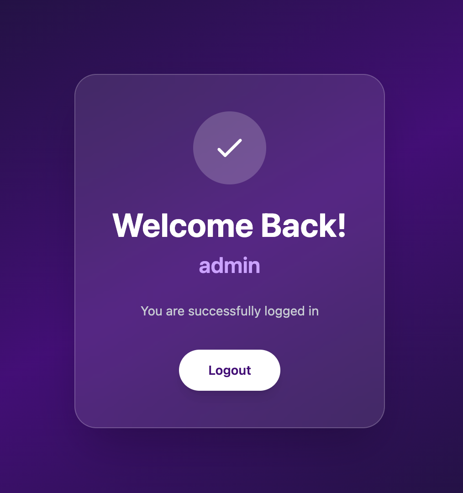
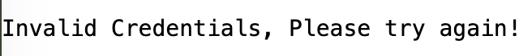
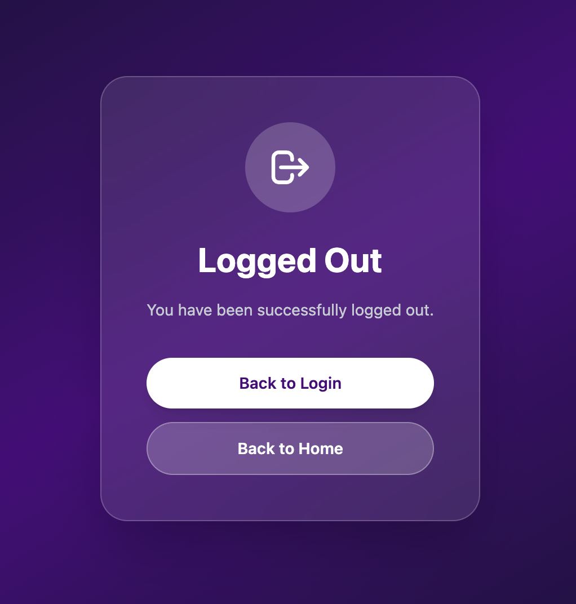

# Flask Login Web App 

A modern authentication web application built with Flask, featuring a beautiful gradient UI and session-based user management.

## ✨ Features

- **Secure Authentication** 
- **Modern UI Design** 
- **User Sessions** (Persistent login state management)
- **Clean Logout** (Secure session termination)

## 🛠️ Tech Stack

- **Backend:** Flask 3.1.2 (Python Web Framework)
- **Frontend:** HTML5 + Tailwind CSS (via CDN)
- **Package Manager:** Poetry
- **Testing:** pytest + pytest-flask
- **Session Management:** Flask Sessions

## Screenshots

### Home Page

---

### Login Page

---

### Welcome Page

---

### Login Fail

---

### Logout Page

---

## 🙏 Acknowledgments

- Flask documentation
- Tailwind CSS for beautiful styling
- Poetry for dependency management

---

**Made with ❤️ using Flask and Tailwind CSS**